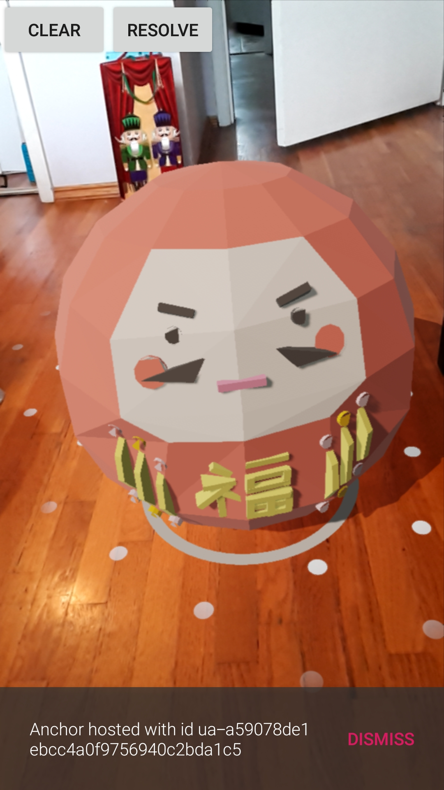
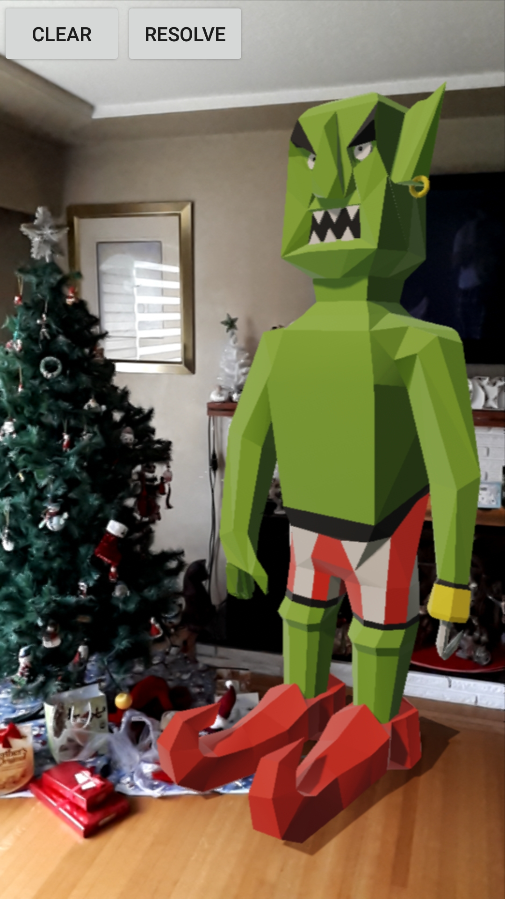

# AR Ground

AR Ground is an app that allows you to view Google Poly models in Augmented Reality and share them 
with the world. Place the models with public visibility and add hints to allow other users to find
the models, or share the scene privately with a short code using Cloud Anchors. 

